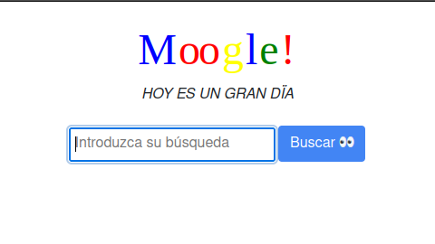
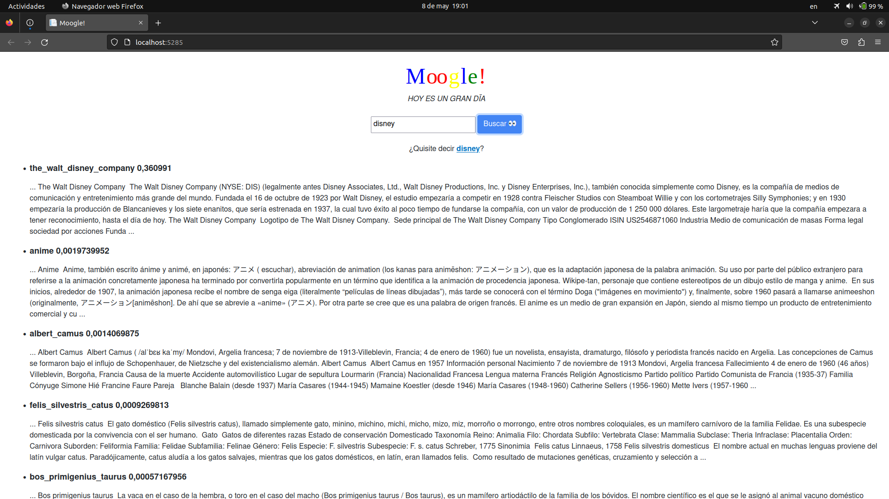
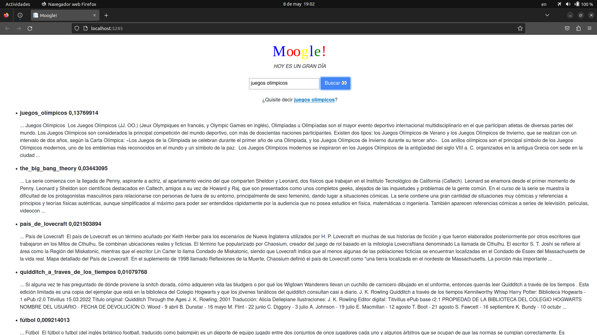

# Moogle!

> Proyecto de Programación I.
> Facultad de Matemática y Computación - Universidad de La Habana.
> Cursos 2021, 2022, 2023

Moogle! es una aplicación *totalmente original* cuyo propósito es buscar inteligentemente un texto en un conjunto de documentos.

Es una aplicación web, desarrollada con tecnología .NET Core 6.0, específicamente usando Blazor como *framework* web para la interfaz gráfica, y en el lenguaje C#.
# Flujo de Funcionamiento .
#### Al iniciar el servidor , este crea una instancia de Searcher el cual carga los Documentos  y los procesa individualmente para obtener los datos relevantes sobre ellos , tales como su nombre, ruta y frecuencia de sus términos , estos luego son utilizados para crear un vocabulario o `"bag of words"` que contiene todos los términos del corpus textual (los documentos)  , con esto hecho se vectorizan los documentos calculando para cada término su frecuencia inversa o IDF y se utiliza esta métrica para normalizar la frecuencia del término en el documento (TF) y asi definir la relevancia de cada uno en el documento y en el corpus , estos vectores son almacenados para utilizarse en las búsquedas .

#### Cuando un usuario realiza una consulta en la interfaz gráfica esta pasa al servidor donde se procesan los datos introducidos por el usuario tales como: separar los operadores procesar los terminos y calcular a cada uno de ellos sus frecuencias utilizando el vocabulario. luego utilizando los vectores de los documentos previamente calculados y el de la consulta se procede a hacer el cálculo de la relevancia o score de cada documento respecto al query , esto se cubre utilizndo la distancia coseno entre vectores la cual es una medida de similitud entre vectores , luego de calcular todos los scores , se organiza la lista de documentos según su score de mayor a menor y se devuelven al usuario .
 
 # Arquitectura básica .
Este proyecto es una implementación del modelo vectorial de recuperación de la información , el cual consite en modelar los documentos y la consulta como vectores en un espacio donde cada componente del vector representa el grado de relevancia de un término , la dimension de este espacio sera igual a la cantidad de términos distintos que existan en el corpus de documentos. Para medir la relevancia se utilizó los pesos TF-IDF , TF significa Term Frequency o frecuencia del término en español y es la cantidad de veces que se repite un término dentro de un documento dado , IDF significa Inverse Document Frecuency o Frecuencia inversa de documento en español y se calcula con la siguiente fórmula Log10(n/d) , donde n es la cantidad total de documentos y d la cantidad de documentos es los que aparece el término , esto representa la relevancia del término en los documentos .Estas dos medidas de relevancia se multiplican y se guardan en las componentes de los vectores de los documentos y la consulta como medida final de la relevancia de cada término.
# Correr el proyecto y la busqueda .
Para correr el proyecto debes usar el comando dotnet watch run --project MoogleServer en Windows y make dev en Linux. En la carpeta Content deberán aparecer los documentos (en formato *.txt) en los que el usuario va a realizar la búsqueda. En la casilla donde aparece Introduzca la búsqueda el usuario va a escribir que desea buscar y basta con apretar el botón Buscar para que Moogle! haga su trabajo.

# Ejemplo del proyecto en funcionamiento .
## ejemplos de la obtención de una busqueda

# Fuentes que utilicé

 - ##### Wikipedia
  - ##### Github
 - ##### ChatGpt
